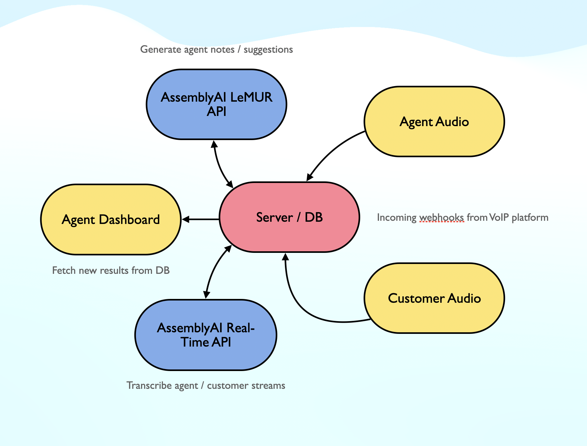

# AssemblyAI Real-Time Agent Assistant: Empowering Agents with AI-Driven Insights



## Overview
Our Real-Time Agent Assistant showcase demo shows the ease of integrating AssemblyAI's transcription and generative AI APIs to enhance contact center operations and empower agents with real-time transcription and AI-driven assistance.

This MVP is perfect for contact centers that are looking to quickly implement AI solutions to improve their customer interactions and operational efficiency. It's an excellent example of how easily our APIs can be integrated into existing systems, providing immediate value with minimal setup time.

## Benefits for Contact Centers
- **Rapid Deployment:** Quick and easy integration with existing systems, minimizing downtime.
- **Enhanced Agent Efficiency:** AI-driven insights and automated note-taking streamline call handling.
- **Improved Customer Experience:** Real-time transcription and AI assistance enable more personalized and effective communication.

## The Technology Behind
1. When the call starts, the VoIP platform starts sending the audio stream from the call to your specified server webhook.
2. Your server webhook collects the stream and routes it to AssemblyAI's [Real-Time websocket API](http://google.com). Data can be streamed in chunks from the VoIP platform to our API. 
3. The AssemblyAI websocket will respond with transcript objects for each chunk sent, containing the transcript text, word confidence scores, and word-level timestamps. If transcribing the agent and customer stream separately, these word timestamps can be used to align both agent and customer transcripts.
4. Optional: the live transcript will be written to your database with a shared conversation ID to link both the agent and customer transcripts.
5. Separate from the websocket connection, requests to the AssemblyAI LeMUR API can be made on a periodical basis. LeMUR leverages the power of large language models to provide detailed analysis of the provided transcript. The API requests will contain the live transcript in the `input_text` parameter, along with prompt instructions in the `prompt` parameter that tell LeMUR what kind of insight we want it to generate.
6. Optional: the outputs from LeMUR can be stored in your database, using the conversation ID as our joining key with your transcript table.
7. Your agent dashboard fetches the live transcript and LeMUR outputs from your database and displays this to the agent in real-time.

## Best Practices
- Some VoIP providers support the ability to send individual streams for the agent and customer. This method is ideal for achieving perfect speaker diarization between customer and agent.
- AssemblyAI's websocket accepts either pcm_s16le or pcm_mulaw encoding – if your VoIP stream is in a different format, transcoding may be required before sending the data to AssemblyAI.
- LeMUR is a synchronous REST API can take several seconds to respond so it's best to keep these calls in a background process or separate function.
- Multiple requests to LeMUR can be challenging for cost-sensitive customers. In order to optimize these costs, we can use clever prompt engineering to reduce the input tokens (e.g. passing in the generated notes versus the full transcript with every request) and reduce output tokens (e.g. asking LeMUR to refine the current notes versus generate new notes).

## Additional Resources
- [AssemblyAI Real-Time API Documentation](https://www.assemblyai.com/docs/api-reference/real-time)
- [AssemblyAI LeMUR API Documentation](https://www.assemblyai.com/docs/api-reference/lemur)
- [How to Transcribe a Phone Call with AssemblyAI and Twilio](https://www.twilio.com/en-us/blog/phone-call-transcription-assemblyai-twilio-node)

## Run the demo
This demo simulates a real-time agent assistant dashboard that displays the live transcript and AI-driven insights. The demo is built with Next.js and uses AssemblyAI's Real-Time and LeMUR APIs. For the purpose of this demo, we are using local mock data to simulate the real-time transcription and AI-driven insights.

### AssemblyAI API Key
Create a ```.env``` file in the root of the project and add the following environment variables:
```bash
NEXT_PUBLIC_ASSEMBLY_AI_API_KEY={your AAI key}
```

### Install Dependencies
```bash
npm install
# or
yarn install
```

### Run the development server:

```bash
npm run dev
# or
yarn dev
```

Open [http://localhost:3000](http://localhost:3000) with your browser to see the result.

You can start editing the page by modifying `pages/index.js`. The page auto-updates as you edit the file.

[API routes](https://nextjs.org/docs/api-routes/introduction) can be accessed on [http://localhost:3000/api/hello](http://localhost:3000/api/hello). This endpoint can be edited in `pages/api/hello.js`.

The `pages/api` directory is mapped to `/api/*`. Files in this directory are treated as [API routes](https://nextjs.org/docs/api-routes/introduction) instead of React pages.

